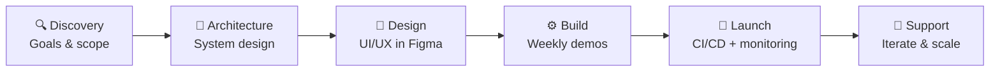

### Building modern SaaS platforms, AI-powered solutions, and scalable digital products with clean architecture.

 

 

---

## 🟠 Octarnal — Where I Build

> I'm the **Co-Founder & COO of [Octarnal](https://octarnal.com)** — a product studio that takes ideas from
> zero to shipped. We handle strategy, architecture, engineering, and deployment so founders can focus on their market.

I built Octarnal from the ground up, which means I understand startup constraints from the inside: tight runway,
moving deadlines, and the need to ship something real. **My job is to make the technical side a non-issue for you.**

| | | |
|:---:|:---:|:---:|
| **⚡ MVP in 6–10 weeks** | **🔁 Zero-downtime delivery** | **📈 Built to scale from day one** |

---

## 🧩 What We Build For Clients

<table>
<tr>
<td width="50%" valign="top">

### 🚀 SaaS Platform Development
End-to-end SaaS products — multi-tenant architecture, subscriptions, role-based access, admin dashboards, and analytics.
**Best for:** founders launching a product.

</td>
<td width="50%" valign="top">

### 🤖 AI Automation & Integration
LLM integrations, intelligent search, chatbots, document processing, and workflow automation — retrofitted into
existing products without a rewrite.
**Best for:** teams adding AI to a live platform.

</td>
</tr>
<tr>
<td width="50%" valign="top">

### 🌐 Full-Stack Web Applications
Fast, accessible, SEO-ready web apps with React and Next.js, backed by robust Node.js / NestJS APIs.
**Best for:** businesses that need a serious web presence.

</td>
<td width="50%" valign="top">

### 🛠 API & System Design
REST APIs, microservices, database modeling, third-party integrations, CI/CD, and Docker-based deployments.
**Best for:** products hitting performance or scaling walls.

</td>
</tr>
<tr>
<td width="50%" valign="top">

### 🛒 E-Commerce & Payments
Headless storefronts, real-time inventory, multi-currency checkout, and Stripe payment flows.
**Best for:** brands selling online at scale.

</td>
<td width="50%" valign="top">

### 🧭 Fractional CTO & Consulting
Technical co-founding support, architecture reviews, team process, and hiring guidance — on a retainer.
**Best for:** non-technical founders with a growing product.

</td>
</tr>
</table>

---

## 🔄 How We Work

**Engagement models:** project-based contracts · monthly retainers · fractional CTO
**Always defined upfront:** scope, timeline, deliverables, and price. No surprise invoices.

---

## 🧰 Tech Stack

**🎨 Frontend**

**⚙️ Backend**

**🗄️ Databases**

**🤖 AI & DevOps**

---

## 🚀 Featured Projects

<table>
<tr>
<td width="50%" valign="top">

### 🏢 Octarnal
Agency site for Octarnal itself — case studies, service pages, and a booking flow built to convert visitors into client calls.

**[octarnal.com](https://octarnal.com)** · `Next.js` `Motion Design`

</td>
<td width="50%" valign="top">

### 🌸 Elorva
E-commerce platform for a luxury fragrance and perfume-decant brand in Bangladesh — product catalog, gift-box builder, and checkout.

**[elorvabd.com](https://elorvabd.com)** · `Next.js` `E-commerce`

</td>
</tr>
<tr>
<td width="50%" valign="top">

### 🧘 Signal Wellness
Client site for a wellness and peptide-therapy platform — informational marketing site with consult booking.

**[signalwellness.io](https://signalwellness.io)** · `Web` `Booking Flow`

</td>
<td width="50%" valign="top">

### 💪 MyoFitness
Booking and marketing site for a Melbourne myotherapy and remedial massage clinic group across multiple locations.

**[myofitness.com.au](https://myofitness.com.au)** · `Web` `Booking Flow`

</td>
</tr>
</table>

---

## ❓ Frequently Asked

<b>What services do you offer?</b>

 
Full-stack web development, AI workflow automation, SaaS architecture consulting, and technical co-founding support — from MVP through enterprise-grade scale.

<b>How long does a typical SaaS MVP take?</b>

 
A well-scoped SaaS MVP usually takes <b>6–10 weeks</b> from discovery to deployment, depending on complexity, integrations, and design iterations.

<b>Can you integrate AI into an existing product?</b>

 
Yes. I specialize in retrofitting AI capabilities — LLM integrations, automation pipelines, and smart feature layers — into existing platforms without a major refactor.

<b>Do you work with early-stage startups?</b>

 
Absolutely. I co-founded Octarnal from zero, so I understand startup constraints and pace. I help startups ship fast, stay lean, and build for scale.

<b>What's your engagement model?</b>

 
Project-based contracts, monthly retainers, and fractional CTO arrangements. Scope and pricing are always defined upfront with clear deliverables.

<b>What happens after launch?</b>

 
Every project ships with CI/CD, monitoring, and documentation. Ongoing support and feature iteration are available on a retainer.

---

## 🤝 Let's Build Something

**Have a product idea, a stalled project, or a system that needs to scale?**
Tell me what you're building — I'll tell you honestly whether I'm the right fit.

 

 

---

<b>📊 GitHub Activity</b>

 

 

*"Transforming ideas into intelligent, high-performing digital products — one line of code at a time."*

